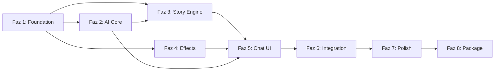

# SENTIENT_OS v2 — Geliştirme Fazları

> **Toplam Süre:** ~13 hafta  
> **Toplam Faz:** 8  
> **Mevcut Durum:** Planlama tamamlandı ✅

---

## Faz Haritası

```
  Hafta 1-2        Hafta 3-4        Hafta 5-6        Hafta 7-8
┌───────────┐   ┌───────────┐   ┌───────────┐   ┌───────────┐
│  FAZ 1    │   │  FAZ 2    │   │  FAZ 3    │   │  FAZ 4    │
│           │   │           │   │           │   │           │
│ Foundation│──►│ AI Core   │──►│ Story     │──►│ Effects   │
│           │   │           │   │ Engine    │   │ + Audio   │
│ WS + DB + │   │ Gemini +  │   │ Narrative │   │ Overlay + │
│ Safety    │   │ Memory +  │   │ Timeline  │   │ TTS +     │
│           │   │ Personality│   │ 3 Finals  │   │ Win32     │
└───────────┘   └───────────┘   └───────────┘   └───────────┘

  Hafta 9-10       Hafta 11         Hafta 12         Hafta 13
┌───────────┐   ┌───────────┐   ┌───────────┐   ┌───────────┐
│  FAZ 5    │   │  FAZ 6    │   │  FAZ 7    │   │  FAZ 8    │
│           │   │           │   │           │   │           │
│ Chat UI + │──►│Integration│──►│ Polish +  │──►│ Package + │
│ Onboarding│   │ Testing   │   │ Sound     │   │ Release   │
│ i18n +    │   │ Edge Cases│   │ Design    │   │ Installer │
│ Mini Game │   │ Perf Test │   │ UX Detail │   │ Beta Test │
└───────────┘   └───────────┘   └───────────┘   └───────────┘
```

---

## Faz Listesi

| # | Faz | Süre | Hedef | Doküman |
|---|-----|------|-------|---------|
| 1 | **Foundation** | 2 hafta | Electron + Python + WebSocket + SQLite + Safety | [FAZ_1_FOUNDATION.md](FAZ_1_FOUNDATION.md) |
| 2 | **AI Core** | 2 hafta | Gemini sohbet + 3 katmanlı memory + personality | [FAZ_2_AI_CORE.md](FAZ_2_AI_CORE.md) |
| 3 | **Story Engine** | 2 hafta | Narrative state machine + timeline + 3 final | [FAZ_3_STORY_ENGINE.md](FAZ_3_STORY_ENGINE.md) |
| 4 | **Effect Engine + Audio** | 2 hafta | Tüm efektler + ambient ses + TTS + Win32 | [FAZ_4_EFFECT_ENGINE.md](FAZ_4_EFFECT_ENGINE.md) |
| 5 | **Chat UI & Onboarding** | 2 hafta | Chat penceresi + onboarding + tray + i18n | [FAZ_5_CHAT_UI.md](FAZ_5_CHAT_UI.md) |
| 6 | **Integration Testing** | 1 hafta | Edge cases + performans + güvenlik testleri | [FAZ_6_INTEGRATION_TESTING.md](FAZ_6_INTEGRATION_TESTING.md) |
| 7 | **Polish & Sound Design** | 1 hafta | Ses finalizasyonu + animasyon + UX detayları | [FAZ_7_POLISH.md](FAZ_7_POLISH.md) |
| 8 | **Packaging & Release** | 1 hafta | PyInstaller + Electron-Builder + beta test | [FAZ_8_PACKAGING.md](FAZ_8_PACKAGING.md) |

---

## Bağımlılık Zinciri



> **Not:** Faz 2 ve Faz 3'ün bazı görevleri paralel ilerleyebilir (AI core + story engine aynı anda). Faz 4 de kısmen Faz 3 ile paralel olabilir (efekt rendering, hikaye motorundan bağımsız test edilebilir).

---

## Her Fazın Kritik Çıktısı

| Faz | "Bu faz bitti" ne demek? |
|-----|--------------------------|
| 1 | Electron + Python başlıyor, WS mesajlaşıyor, kill switch çalışıyor |
| 2 | Terminal'de AI ile Türkçe sohbet, memory ve kişilik çalışıyor |
| 3 | Hikaye Katman 1→2→3 otomatik akıyor, 3 yol dallanıyor |
| 4 | Tüm efektler Electron'da render ediliyor, ses çalıyor, TTS konuşuyor |
| 5 | Baştan sona 35 dk oynanabilir alpha, chat + onboarding + i18n |
| 6 | Tüm edge case'ler ve güvenlik testleri geçiyor |
| 7 | Deneyim premium hissettiriyor, sesler finalize |
| 8 | Tek tıkla kurulabilir .exe, beta test tamamlanmış |
